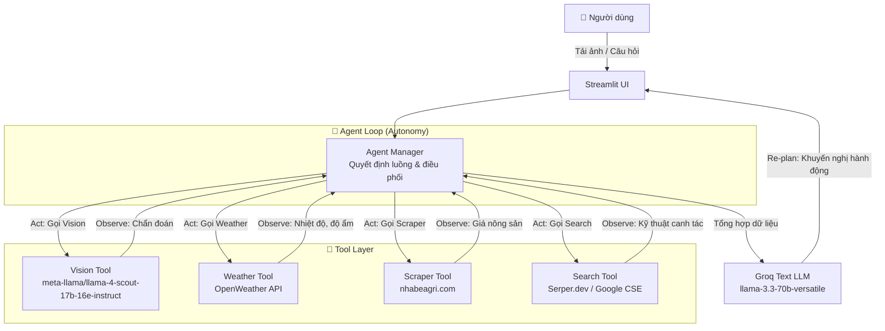

# 🌾 AIDEV - Trợ lý Nông nghiệp Thông minh (AI Agent)

[](https://www.python.org/)
[](https://streamlit.io/)
[](https://groq.com/)
[](https://github.com/shirmtry/AIDEV)

**AIDEV** là một trợ lý ảo đa tác vụ (Multi-Agent) chuyên về lĩnh vực nông nghiệp, đặc biệt là cà phê. Hệ thống tích hợp AI thị giác (Vision), tìm kiếm thông tin, phân tích giá cả thị trường, dữ liệu thời tiết và mô hình ngôn ngữ lớn (LLM) để đưa ra các khuyến nghị canh tác chính xác, kịp thời cho nông dân khu vực Tây Nguyên – Bình Định.

---

## 🚀 Tính năng chính

- **🖼️ Nhận diện bệnh hại qua ảnh**: Sử dụng model `meta-llama/llama-4-scout-17b-16e-instruct` (Groq) để phân tích ảnh cây trồng, phát hiện sâu bệnh và tình trạng sức khỏe.
- **📊 Phân tích thị trường**: Cào dữ liệu giá nông sản (Robusta, Arabica...) theo thời gian thực.
- **🌦️ Dự báo thời tiết**: Lấy dữ liệu thời tiết khu vực Tây Nguyên (hiện tại hỗ trợ Gia Lai) để đánh giá tác động đến mùa vụ.
- **🔍 Tìm kiếm thông tin chuyên sâu**: Tích hợp Serper.dev (Google Search) để tìm kiếm kỹ thuật canh tác, phân bón, thuốc BVTV.
- **💡 Đề xuất thông minh**: Tổng hợp tất cả dữ liệu, sử dụng Groq `llama-3.3-70b-versatile` để đưa ra chiến lược hành động cụ thể (Ngay lập tức, Trong tuần, Dài hạn).

---

## 🧠 Kiến trúc hệ thống & Vòng lặp tự chủ (Act → Observe → Re‑plan)

Hệ thống được thiết kế theo mô hình **Agent tự chủ** với vòng lặp liên tục: **Act (hành động)** → **Observe (quan sát kết quả)** → **Re‑plan (điều chỉnh kế hoạch)**. Agent tự quyết định tool nào cần gọi, thứ tự gọi và cách xử lý khi gặp lỗi (retry hoặc chuyển hướng) mà không cần người dùng ra lệnh từng bước.



### Bảng Input / Output của từng Tool

| Thành phần          | Input (đầu vào)                  | Output (đầu ra)                                               |
|---------------------|----------------------------------|---------------------------------------------------------------|
| **Vision Tool**     | Ảnh cây trồng (upload)           | Chẩn đoán sâu bệnh, tình trạng sức khỏe (dạng văn bản)      |
| **Weather Tool**    | Tên tỉnh/thành (VD: Gia Lai)     | Nhiệt độ, độ ẩm, tình trạng mây, mưa…                         |
| **Scraper Tool**    | Tên nông sản (VD: Cà phê Robusta)| Giá hiện tại, biến động (%)                                   |
| **Search Tool**     | Từ khóa tìm kiếm (VD: kỹ thuật canh tác) | Kết quả tóm tắt từ 3 trang web hàng đầu                  |
| **Groq Text LLM**   | Tổng hợp từ 4 tool trên + prompt | Khuyến nghị hành động cụ thể (Ngay lập tức/Trong tuần/Dài hạn) |

---

## 📊 Tác động thực tiễn (Real Impact)

- **Tiết kiệm thời gian**: Nông dân thường mất 3–4 giờ mỗi tuần để tìm kiếm thông tin giá cả, thời tiết và kỹ thuật từ nhiều nguồn khác nhau. AIDEV rút ngắn xuống chỉ **2 phút** – tiết kiệm **≈ 90% thời gian**.
- **Giảm chi phí**: Nhờ cảnh báo sâu bệnh sớm và đề xuất biện pháp phù hợp, giúp giảm thiểu rủi ro mất mùa, ước tính giảm tổn thất khoảng **15–20%** mỗi vụ.
- **Người dùng mục tiêu**: Nông dân trồng cà phê tại các tỉnh Gia Lai, Đắk Lắk, Lâm Đồng, Kon Tum – khoảng **hàng nghìn hộ** có thể sử dụng.

---

## 📋 Yêu cầu hệ thống

- Python 3.10 hoặc cao hơn
- Pip (trình quản lý gói)
- Tài khoản API cho các dịch vụ:
  - [Groq](https://groq.com/) (cần API Key)
  - [OpenWeather](https://openweathermap.org/) (cần API Key)
  - [Serper.dev](https://serper.dev/) (Khuyến nghị - 2500 lượt tìm kiếm miễn phí/tháng)

---

## ⚙️ Cài đặt & Cấu hình

### 1. Clone dự án
```bash
git clone https://github.com/shirmtry/AIDEV.git
cd AIDEV
```

### 2. Tạo môi trường ảo (Khuyến nghị)
```bash
python -m venv venv
# Windows
venv\Scripts\activate
# Linux/Mac
source venv/bin/activate
```

### 3. Cài đặt thư viện
```bash
pip install -r requirements.txt
```
*(Nếu chưa có `requirements.txt`, hãy cài thủ công: `pip install streamlit openai python-dotenv requests beautifulsoup4 lxml`)*

### 4. Cấu hình biến môi trường (.env)
Tạo file **`.env`** tại thư mục gốc và điền các key cần thiết:

```env
# =============================================
# BIẾN MÔI TRƯỜNG - BẮT BUỘC
# =============================================

# --- BẮT BUỘC ---
GROQ_API_KEY=your_groq_api_key_here
OPENWEATHER_API_KEY=your_openweather_api_key_here

# --- TÙY CHỌN: Telegram ---
TELEGRAM_BOT_TOKEN=your_telegram_bot_token_here

# --- TÙY CHỌN: Tìm kiếm (chọn 1 trong 2) ---
# Ưu tiên dùng Serper.dev (nhanh, ổn định, 2500 lượt/tháng miễn phí)
SERPER_API_KEY=your_serper_api_key_here
# Hoặc dùng Google Custom Search Engine
GOOGLE_API_KEY=your_google_api_key
GOOGLE_CSE_ID=your_search_engine_id

# =============================================
# CẤU HÌNH MODEL (Mặc định đã tối ưu)
# =============================================

# ✅ Model Vision (Groq) - LƯU Ý: Phải có prefix "meta-llama/"
GROQ_VISION_MODEL=meta-llama/llama-4-scout-17b-16e-instruct

# ✅ Model Text (Groq) - llama-3.3-70b-versatile hoặc llama-3.1-70b
GROQ_TEXT_MODEL=llama-3.3-70b-versatile
```

> **⚠️ Lưu ý quan trọng:** Model Llama-4 trên Groq yêu cầu **prefix `meta-llama/`**, nếu không sẽ báo lỗi 404. Cấu hình trên đã đúng chuẩn.

---

## ▶️ Chạy ứng dụng

Sau khi cài đặt và cấu hình, khởi chạy ứng dụng bằng lệnh:

```bash
streamlit run app.py
```

Ứng dụng sẽ tự động mở tại địa chỉ:
- **Local:** `http://localhost:8501`
---

## 🧠 Luồng xử lý bên trong (Agent Flow)

Khi bạn tải ảnh hoặc gửi câu hỏi, Agent tự động thực hiện các bước sau **mà không cần can thiệp thủ công**:

1. **Vision Tool** → Phân tích ảnh, trả về chẩn đoán.
2. **Weather Tool** → Lấy thời tiết khu vực.
3. **Scraper Tool** → Lấy giá nông sản.
4. **Search Tool** → Tìm kiếm kỹ thuật canh tác phù hợp.
5. **Groq Text LLM** → Tổng hợp và sinh khuyến nghị.

Nếu bất kỳ tool nào thất bại (timeout, lỗi API), Agent sẽ:
- Tự động **retry** tối đa 2 lần.
- Nếu vẫn lỗi, chuyển sang **chiến lược thay thế** (ví dụ: bỏ qua tool đó và vẫn đưa ra khuyến nghị từ các nguồn còn lại).

### 🔍 Kết quả đầu ra mẫu

**Terminal log**:
```log
2026-06-21 05:22:26 [INFO] tools.vision_tool: Model 'meta-llama/llama-4-scout-17b-16e-instruct' phân tích thành công.
2026-06-21 05:22:27 [INFO] tools.scraper_tool: Đang cào dữ liệu giá cho 'Cà phê Robusta'...
2026-06-21 05:22:28 [INFO] tools.weather_tool: Lấy thời tiết cho: Gia Lai
2026-06-21 05:22:31 [INFO] tools.groq_text_tool: Groq Text phản hồi thành công.
```

**Giao diện Streamlit** – khuyến nghị chi tiết:
- 🔍 **Chẩn đoán tình trạng cây**
- 📈 **Phân tích thị trường**
- 🌤️ **Ảnh hưởng của thời tiết**
- ✅ **Khuyến nghị cụ thể** (Ngay lập tức / Trong tuần / Dài hạn)
- 💡 **Mẹo kỹ thuật**

---

## 📁 Cấu trúc thư mục dự án

```
AIDEV/
├── app.py                 # File chính của ứng dụng Streamlit
├── .env                   # File chứa biến môi trường (Tạo thủ công)
├── requirements.txt       # Danh sách thư viện Python
├── README.md              # File hướng dẫn này
└── tools/                 # Thư mục chứa các công cụ (Agent Tools)
    ├── vision_tool.py     # Xử lý ảnh với Groq Vision
    ├── scraper_tool.py    # Cào dữ liệu giá nông sản
    ├── weather_tool.py    # Lấy dữ liệu thời tiết
    ├── search_tool.py     # Tìm kiếm Google (Serper/CSE)
    └── groq_text_tool.py  # Gọi Groq LLM sinh văn bản
```

---

## 🤝 Đóng góp & Phát triển

- **Mở rộng khu vực**: Hiện tại đang test với Gia Lai, bạn có thể sửa city trong `weather_tool.py` để hỗ trợ Đắk Lắk, Lâm Đồng, Kon Tum...
- **Thêm nguồn giá**: Bổ sung thêm URL cào dữ liệu trong `scraper_tool.py`.
- **Cải thiện autonomy**: Thêm cơ chế tự học từ phản hồi của nông dân để tối ưu khuyến nghị.

---

## 📜 Giấy phép

Dự án mã nguồn mở, sử dụng cho mục đích học tập và nghiên cứu.

---

**🏆 Chúc bạn và bà con nông dân mùa màng bội thu! 🌱**